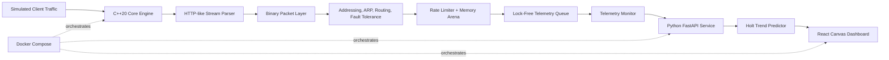

# Distributed Network Simulator Platform

A full-stack network simulator built to connect low-level networking concepts with real systems engineering.

This project models a packet-processing pipeline from the C++ socket layer up to telemetry analysis and a browser dashboard. It is designed as a learning and portfolio project for understanding how networks, operating systems, backend APIs, observability, and deployment fit together in one architecture.

> Current status: the repository contains the C++20 core engine, Python/FastAPI telemetry service, React dashboard, and Docker configuration. Some production-hardening work remains, especially Linux container portability for the kqueue-based C++ event loop and a packet payload implementation mismatch noted below.

## What This Project Demonstrates

- Raw TCP server/client abstractions using RAII-style socket ownership.
- Binary packet serialization, network byte order conversion, and protocol-style encapsulation.
- ARP cache simulation with bounded LRU eviction.
- IPv4 parsing, CIDR/subnet validation, and local-network boundary checks.
- Multi-hop routing with Dijkstra shortest path and Longest Prefix Match lookup.
- Circuit breaker and exponential backoff behavior for link-failure resilience.
- Lock-free single-producer/single-consumer telemetry queue with cache-line alignment.
- GCRA-based rate limiting in the packet path.
- FastAPI telemetry ingestion and Holt's Linear Trend anomaly prediction.
- React dashboard with Canvas-based topology visualization.
- Multi-service packaging with Dockerfiles and Docker Compose.

## Architecture



### Service Responsibilities

| Layer | Technology | Responsibility |
| --- | --- | --- |
| Core engine | C++20 | Socket I/O, packet parsing, subnet logic, routing, rate limiting, fault tolerance, telemetry generation |
| Telemetry bus | C++20 | Lock-free SPSC queue and background metric aggregation |
| Intelligence service | Python, FastAPI, Pydantic | Telemetry API, anomaly prediction, latest-analysis cache |
| Dashboard | React, Vite, Canvas | Real-time topology view, link status, anomaly alerts |
| Infrastructure | Docker, Docker Compose | Multi-service build and private bridge network |

## Repository Structure

```text
network-simulator-platform/
|-- README.md
|-- core-engine/
|   |-- CMakeLists.txt
|   |-- include/
|   |   |-- core/          # sockets, packets, messages, memory arena
|   |   |-- network/       # nodes, ARP, addressing, routing, rate limiting, circuit breaker
|   |   |-- protocols/     # HTTP-like stream parser
|   |   `-- system/        # event loop, telemetry queue, monitor
|   `-- src/
|       |-- core/
|       |-- network/
|       |-- protocols/
|       |-- system/
|       `-- main/          # network_test and network_core entry points
|-- ai-service/
|   |-- main.py            # FastAPI application
|   |-- requirements.txt
|   `-- models/
|       |-- schemas.py     # Pydantic request/response models
|       `-- predictor.py   # Holt trend anomaly predictor
|-- dashboard/
|   |-- package.json
|   |-- vite.config.js
|   `-- src/
|       |-- main.jsx
|       `-- App.jsx
`-- infra/
    |-- docker-compose.yml
    |-- core.Dockerfile
    |-- ai.Dockerfile
    `-- dashboard.Dockerfile
```

## Phase Roadmap

| Phase | Area | What was built |
| --- | --- | --- |
| 1 | Communication core | RAII socket wrapper, TCP connection abstraction, non-blocking server |
| 2 | Packet layer | Binary packet header/payload model and serialization/deserialization |
| 3 | Link layer | ARP-style IP-to-MAC cache with LRU eviction |
| 4 | Application protocol | Fragment-tolerant HTTP-like parser using a finite-state machine |
| 5 | Network layer | IPv4 parsing, subnet masks, CIDR checks, local/remote decision logic |
| 6 | Routing | Link-state route computation with Dijkstra and LPM route lookup |
| 7 | Observability | Lock-free telemetry queue and background aggregation thread |
| 8 | Fault tolerance | Circuit breaker state machine and exponential backoff with jitter |
| 9 | Traffic control | Atomic GCRA rate limiter and aligned memory arena |
| 10 | Core daemon | Persistent kqueue-based event loop tying phases 1-9 together |
| 11 | AI service | FastAPI telemetry API and Holt trend anomaly prediction |
| 12 | Dashboard | React dashboard with Canvas topology rendering and alert panels |
| 13 | Orchestration | Dockerfiles and Docker Compose service network |
| 14 | Future persistence | Planned DBMS-backed telemetry, topology, predictions, and alerts |
| 15 | Future productionization | Planned tests, CI, auth, health checks, and deployment hardening |

## Getting Started

### Prerequisites

- CMake 3.20+
- A C++20 compiler
- Python 3.11+
- Node.js 18+
- Docker and Docker Compose

The C++ engine uses POSIX networking APIs. The current event loop implementation uses `kqueue`, which is native to macOS/BSD-like systems. Linux support should use an `epoll` backend or a portability layer before the core service is treated as Linux-container-ready.

### Build and Run the C++ Core

```bash
cd core-engine
cmake -S . -B build -DCMAKE_BUILD_TYPE=Release
cmake --build build
```

Run the validation driver:

```bash
./build/network_test
```

Run the persistent core daemon:

```bash
./build/network_core
```

By default, the daemon starts a non-blocking TCP server on port `9090`.

### Run the FastAPI Service

```bash
cd ai-service
python -m venv .venv
source .venv/bin/activate
pip install -r requirements.txt
uvicorn main:app --host 0.0.0.0 --port 8000
```

Health check:

```bash
curl http://127.0.0.1:8000/health
```

Latest analysis:

```bash
curl http://127.0.0.1:8000/telemetry/analysis
```

### Run the Dashboard

```bash
cd dashboard
npm install
npm run dev
```

The dashboard polls:

```text
http://127.0.0.1:8000/telemetry/analysis
```

### Run with Docker Compose

```bash
cd infra
docker compose up --build
```

Expected exposed services:

- FastAPI service: `http://localhost:8000`
- Dashboard via Nginx: `http://localhost:3000`

Note: the C++ Docker image is currently Ubuntu-based while the event loop uses `kqueue`. Use this Compose setup as the intended orchestration shape; for full Linux container compatibility, add an `epoll` event loop backend or a portability abstraction.

## API Overview

### `GET /health`

Returns basic service health.

```json
{
  "status": "healthy",
  "service": "ai-telemetry-service"
}
```

### `POST /telemetry/stream`

Accepts telemetry data and returns an anomaly prediction.

```json
{
  "timestamp_us": 1720000000000,
  "source_node": "RouterA",
  "dest_node": "RouterB",
  "packet_size": 1000,
  "latency_ns": 150.0,
  "dropped_packets": 0,
  "throughput_kbps": 1200.0
}
```

### `GET /telemetry/analysis`

Returns the latest cached prediction per source/destination link.

## Key Implementation Notes

### C++ Core

- `SocketFD` owns a raw file descriptor and closes it automatically.
- `Connection` performs non-blocking send/receive operations.
- `HttpSim` parses request chunks incrementally so TCP fragmentation does not break application-level messages.
- `Router::compute_routes` recalculates paths and inflates failed-link costs when a circuit breaker is open.
- `SpscRingBuffer` uses atomics and cache-line alignment to avoid a mutex in the packet-to-telemetry path.
- `TelemetryMonitor` drains the queue from a worker thread and computes rolling metrics.
- `GcraRateLimiter` uses compare-and-swap on theoretical arrival time to enforce traffic limits.
- `MemoryArena` provides fast bump allocation for trivially destructible packet-path objects.

### Python Service

- `TelemetryData` and `AnomalyPrediction` define the API contract with Pydantic.
- `TelemetryPredictor` keeps per-link latency history and Holt level/trend state.
- The current service stores telemetry and analysis in memory; persistent storage is planned.

### React Dashboard

- Polls the FastAPI service every second.
- Stores latest analysis and alert history in React state.
- Draws network nodes and link health with HTML5 Canvas.
- Highlights anomalous links with red dashed styling.

## Known Limitations and Next Steps

- Reconcile `Packet` payload representation: `packet.hpp` uses a fixed `uint8_t payload[1500]`, while `packet.cpp` still contains vector-style payload operations.
- Add a Linux `epoll` backend or portability abstraction for the C++ event loop.
- Wire the C++ telemetry monitor to the Python service through a real HTTP or streaming integration path.
- Add persistent storage for telemetry, predictions, topology snapshots, and alerts.
- Add automated tests for C++ components, FastAPI endpoints, and dashboard rendering states.
- Add service health checks to Docker Compose.
- Add authentication and configuration management before exposing the API beyond local development.

## Future DBMS Model Which Can Be Used

Useful tables for the persistence phase:

- `simulation_runs`
- `nodes`
- `links`
- `telemetry_events`
- `predictions`
- `alerts`

This would allow the dashboard to move from "latest state only" to historical debugging, incident review, and long-running simulation analysis.

## Learning Value

This project is intentionally cross-disciplinary:

- Computer Networks: sockets, TCP, ARP, IP addressing, subnetting, routing, congestion signals.
- Operating Systems: file descriptors, non-blocking I/O, event loops, threads, atomics, memory allocation.
- Backend Engineering: API contracts, validation, background tasks, anomaly scoring.
- Frontend Engineering: polling, state management, Canvas rendering, alert UI.
- DevOps: container builds, service networking, runtime boundaries.
- DBMS Design: planned persistence, indexing, retention, and historical analysis.
